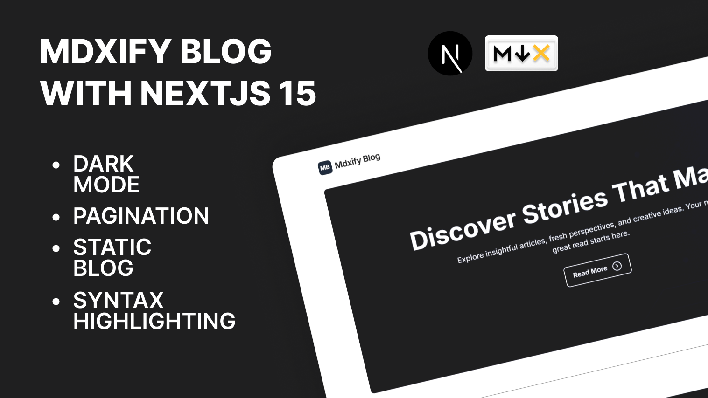

# MDXify Blog



MDXify Blog is a modern, fast, and flexible blog platform built with Next.js 15 and MDX. It allows you to write your blog posts in Markdown with the power of JSX.

## Features

- Next.js 15 with App Router
- MDX/Markdown for writing content
- Tailwind CSS, Tailwind Typography for styling
- Dark mode support
- SEO optimized
- Responsive design
- Syntax highlighting

## Getting Started

To get started with MDXify Blog, follow these steps:

1. Clone the repository:

```bash
git clone https://github.com/Raka-coder/mdxify-next-blog

cd blogweb
```
2. Install the dependencies:
```bash
bun install // bun
    or 
npm install // npm
```
3. Start the development server:
```bash
bun dev     // bun
    or
npm run dev // npm         
```

4. Open your browser and navigate to http://localhost:3000


## Project Structure
The project structure is as follows:
```
blogweb/
├── app/
│   ├── posts/
│   ├── types/
│   ├── utils/
│   ├── globals.css
│   ├── layout.tsx
│   └── page.tsx
├── assets/
├── components/
├── contents/
│   └── posts/
├── context/
├── public/
├── bun.lock
├── eslint.config.mjs
├── next.config.ts
├── package.json
└── README.md
```

## Writing Content

To write content in MDXify Blog, you can use the `mdx` extension for your files. For example, if you have a post called `index.mdx`, you can write your content in it.

create a new folder in the `contents/posts` directory.
use `index.mdx` as the filename for your post.

## Customization
You can customize the blog by modifying the following files:
- `app/layout.tsx`: Customize the layout of your blog.
- `app/page.tsx`: Customize the home page of your blog.

## Learn More

To learn more about the technologies used in this project, check out the following resources:

- [Next.js Documentation](https://nextjs.org/docs) - learn about Next.js features and API.
- [MDX Documentation](https://mdxjs.com/) - MDX - learn about MDX and how to use it.
- [Tailwind CSS](https://tailwindcss.com/) - learn about Tailwind CSS.

## Resources

- [Lucide React](https://lucide.dev/) - A collection of open source icons.
- [Prism React Renderer](https://github.com/FormidableLabs/prism-react-renderer) - A React renderer for Syntax Highlighting.
- [React Tooltip](https://react-tooltip.com/) - A lightweight, accessible tooltip component.
- [Sonner](https://www.npmjs.com/package/sonner) - A modern notification library for React.

## License